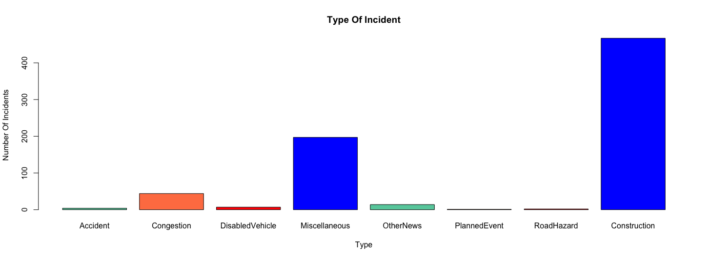
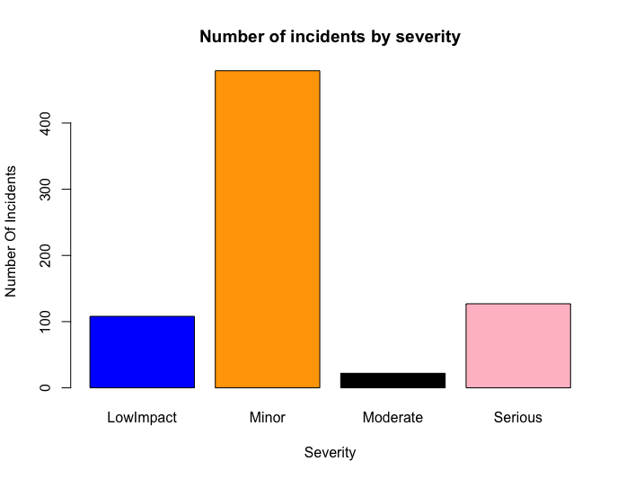
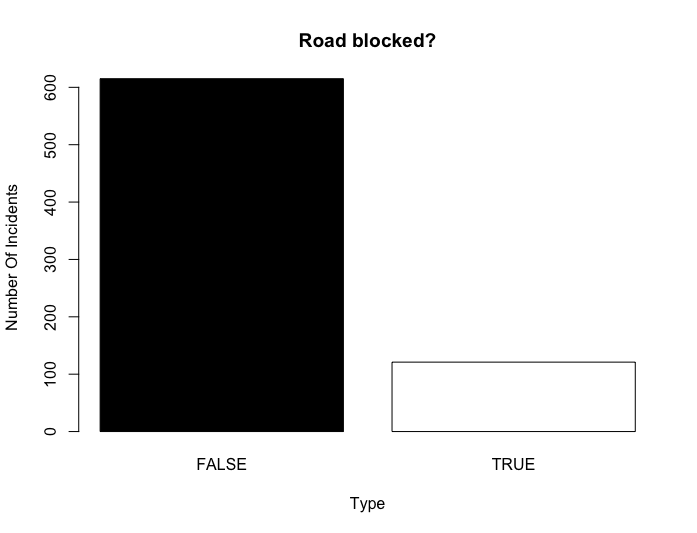

## Traffic Incidents:

As we all know, most of the citizens of Israel assume that we have a lot of traffic incidents in our country.
A lot of Israel citizens assumes that the reason for most of the traffic incidents is the typical character of the citizens.
As part of the our course homework, we decided to investigate if the traffic incidents problem occurring also in other regions.
For investigating this assumption, we will use api that provide us with the most recent traffic incidents by region.
We choose our region to be Netherlands and north Germany.

We will investigate several the traffic incidents types including: accidents, road hazards, construction, congestion, etc..

**We investigated the 11.04.2016, please notice that we used some of the graph as images because of the dynamic data we get from the site(the data change every few minutes, we also attached the relevant R code).**

For using the api and the graphs we installed and imported the following packages: jsonlite, ggmap.

## Gets the data:
For accessing the data using api we use the following commands:
```{r}
require("jsonlite")
library(ggmap)
jsonData <- fromJSON("http://dev.virtualearth.net/REST/v1/Traffic/Incidents/50,2.5,58,9?key=AvrDZTCvZ5v_X0m6mAnLHx0shcIWojjs20aWvBWVpRnaoIUDokU1eth0Mon2o08h")
```
**the returned json file contain a list of all traffic incidents within the region in the last day, the chosen day is 11/04/2016**

## Plots

The first plot divides the the traffic incidents to types:



As we can see most of the traffic incident are construction.
The region we choose(especially north Germany), is under a construction program for re-establish roads, this face explain the high number of construction.
We can also notice that there is a significant number of miscellaneous traffic incidents, under this category we can specify some values including: congestion due to an culture event(the regular congestion is for day-to-day congestion, for example early morning congestion), damaged road, etc..
But, the most interesting data that we can learn from this graph is the low number of accidents, with only 4 traffic accidents.
The average of traffic incident in Israel is about 4(unofficial data - this number refers only to reported accident), we must take in notice that the region we are investigating is a lot bigger than the Israel.


The second plot divides the the traffic incidents by severity:


We can see that most of the traffic accidents are with minor severity.
Also we can see the number of serious traffic incidents which indicates that the incidents cause damage(human,property or time).


The third plot is showing the number of the incidents that cause blocked road:


As we can see most of the incidents weren't cause the road to be blocked.
We can remember that we saw that there was a lot of construction incident and a lot of those incidents doesn't cause blocking.

Map of the traffic incidents:


**Please notice that running the R code can cause failure, due to the dynamic change of the data given by the api**

## Summary
As we saw traffic incidents are very common in other regions as well.
We were suprised by the low amount of accidents.

1. See if the data is consistent(to verify that the numbers aren't low/high compared to other days)
2. Compare the data to data based on Israel region.
3. Investigate the number road traffic injuries and death.
4. Analyze the traffic incidents by time:
  + Which hour is more problematic?
  + If there is a connection between the incident start hour to the incident severity.