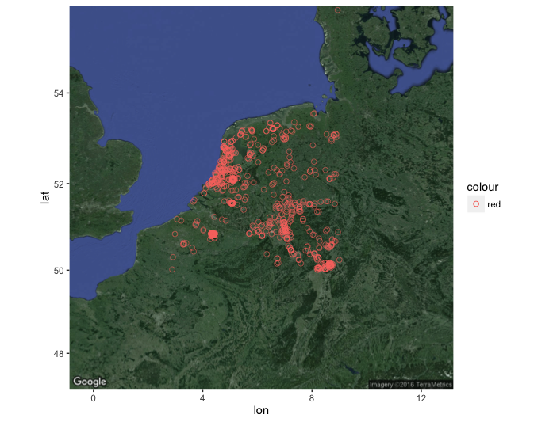

```{r setup, include=FALSE}
knitr::opts_chunk$set(echo = TRUE)
```

## Traffic Incidents:

As we all know, most of the citizens of Isreal assume that we have a lot of traffic incidents in our country.
A lot of Israel citizents assumes that the reason for most of the traffic incidents is the typical charcter of the citizens.
As part of the our course homework, we decided to invesigate if the assumption about Israel is correct.
For invesigating this assumption, we will use api that provide us with the most recent traffic incidents by region.
We choose our region to be Netherlands and north Germany.

We will invesigate several the traffic incidents types including: accidents, road hazards, construction, congestion, etc..

**We insvistagted the 11.04.2016, please notice that we used some of the graph as images because of the dynamic data we get from the site(the data change every few minutes, we also attached the relevant R code).**

For using the api and the graphs we installed and imported the following packages: jsonlite, ggmap.

## Gets the data:
For accessing the data using api we use the following commands:
```{r}
require("jsonlite")
library(ggmap)
jsonData <- fromJSON("http://dev.virtualearth.net/REST/v1/Traffic/Incidents/50,2.5,58,9?key=AvrDZTCvZ5v_X0m6mAnLHx0shcIWojjs20aWvBWVpRnaoIUDokU1eth0Mon2o08h")
```

## Plots

The first plot divides the the traffic incidents to types:


As we can see most of the traffic incident are construction.
The region we choose(escpically north Germany), is under a construction program for re-establish roads, this face explain the high number of construction.
We can also notice that there is a significant number of misclleneous traffic incidents, under this category we can specify some values including: congetsion due to an culture event(the regular congestion is for day-to-day congestion, for example early morning congestion), damaged road, etc..
But, the most instersting data that we can learn from this graph is the low number of accidents, with only 4 traffic accidents.
The average of traffic incident in Israel is about 4(unoffical data - this number refers only to reported accident), we must take in notice that the region we are investigating is a lot bigger than the Israel.


The second plot divides the the traffic incidents by severity:


We can see that most of the traffic accidents are with minor severity.
Also we can see the number of serious traffic indicets which indicates that the indcidents cause damage(human,property or time).


The third plot is showing the number of the incidents that cause blocked road:


As we can see most of the incidents weren't cause the road to be blocked.
We can remebmber that we saw that there was a lot of construction incident and a lot of those incidents doesn't cause blocking.

Map of the traffic incidents:



**Please notice that running the R code can cause failure, due to the dynamic change of the data given by the api**